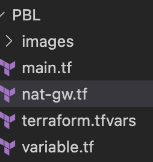
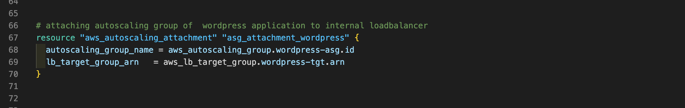

# USING TERRAFORM IAC TOOL TO AUTOMATE AWS CLOUD SOLUTION FOR 2 COMPANY WEBSITES - CONTINUATION

This is a countinuation of [Project-16](https://github.com/Olaminiyi/Project-16).

We will continue to reference the infrastracture


In this Project, we will continue creating the resources for the AWS setup. The resources to be created include:

- 4 Private subnets
- 1 Internet Gateway
- 1 NAT Gateway
- 1 Elastic IP
- 2 Route tables
- IAM roles
- Security Groups
- Target Group for Nginx, WordPress and Tooling
- Certificate from AWS certificate manager
- External Application Load Balancer and Internal Application Load Balancer.
- Launch template for Bastion, Tooling, Nginx and WordPress
- Auto Scaling Group (ASG) for Bastion, Tooling, Nginx and WordPress
- Elastic Filesystem
- Relational Database (RDS)

### CREATE 4 PRIVATE SUBNETS AND TAGGING

we've already created 2 public subnets, we are going to create 4 private subnet according to our diagram

### Tagging
Tags all the resources you have created so far. Explore how to use format() and count functions to automatically tag subnets with its respective number.

we are going to use the `merge` and `format function` of terraform add and format tag name to our dynamically generated VPC's, it merge our variable name(already declared) with variable count that returns the number of VPC generated and use the `%s` to format how the name is placed


### Networking

Private subnets & best practices
- Create 4 private subnets keeping in mind following principles:
- Make sure you use variables or length() function to determine the number of AZs
- Use variables and cidrsubnet() function to allocate vpc_cidr for subnets
- Keep variables and resources in separate files for better code structure and readability
  
### creating private subnet
we have to increase the count index of cirdr to +2 so it won't overlap. you can increase either that of publc or private.

We will create 4 subnets by updating the main.tf with the following code.
```
resource "aws_subnet" "private" {
  count                   = var.preferred_number_of_private_subnets == null ? length(data.aws_availability_zones.available.names) : var.preferred_number_of_private_subnets
  vpc_id                  = aws_vpc.main.id
  cidr_block              = cidrsubnet(var.vpc_cidr, 8, count.index + 2)
  map_public_ip_on_launch = true
  availability_zone       = data.aws_availability_zones.available.names[count.index]

  tags = merge(
    var.tags,
    {
      Name = format("%s-PrivateSubnet-%s", var.name, count.index)
    },
  )

}
```


***The next resource to create is the NAT Gateway**
- created a new file called nat-gw.tf



- created elastic ip and natgateway there


- created a new file called internet-gw.tf


- added environment to the var.tf and tfvars for nat.gtw tags

***create route table**
- we need to create 2 route tables 
- create a file called routes.tf
- we will create the following resources in the file
- create private route table


- create route for the private route table and attatch a nat gateway to it


We need to creat a route also: it determine the path that traffic goes in and out of a subnet. Associate all private subnets to the private route table


- create route table for the public subnets


- create route for the public route table and attach the internet gateway


- associate all public subnets to the public route table


let's run Terraform init, plan and apply and check if our resources are created without any error


  
### The next resource to create is certificate manager
- create a file called cert.tf
- we will do the create the following in the file
- Create the certificate using a wildcard for all the domains created in olami.uk


- call the hosted zone
> [!NOTE]
> YOU MUST HAVE CREATED THIS HOSTED ZONE MANUALLY ON THE AWS CONSOLE


- select validation method


- validate the certificate through DNS method


- create records for tooling


- create records for wordpress


    

### The next resource we need to create is the security group
- create a file called security.tf
- we will configure the following in the file
- create security group for alb, to allow acess from any where for HTTP and HTTPS traffic


- create security group for bastion, to allow access into the bastion host from you IP


- create security group for nginx reverse proxy, to allow access only from the extaernal load balancer and bastion instance


- create security group for internal load balancer (ialb), to have acces only from nginx reverser proxy server


- create security group for webservers, to have access only from the internal load balancer and bastion instance


- create security group for datalayer to alow traffic from websever on nfs and mysql port and bastiopn host on mysql port  


    

### The next step is to create the Application Load balancer
- create a file called alb.tf
- we will create the following in the file       
- create External Load balancer for reverse proxy nginx


- create a target group for the external load balancer


- create a listener for the load balancer


- create Internal Load Balancers for webservers


- create target group  for wordpress


- create target group for tooling


- create a single listener for wordpress which is default


- create a rule to route traffic to tooling when the host header changes


### AWS Identity and Access Management

We want to pass an IAM role our EC2 instances to give them access to some specific resources, so we need to do the following:
- Create AssumeRole: Assume Role uses `Security Token Service (STS)` `API` that returns a set of temporary security credentials that you can use to access AWS resources that you might not normally have access to. These temporary credentials consist of an `access key ID`, a `secret access key`, and a `security token`. Typically, you use `AssumeRole` within your account or for `cross-account access`.

- lets create a file called roles.tf
- a roles is like a container that holds policy such that any resources assume that can perfom some action define by that policy


### The next resource to create is the Launch templates for webservers

- to get ami; try to lauch an ubuntu server and copy the ami (free tier ami)


- we are creating lauch template and autoscaling group in a file. we will do for 2 resources in a file
- create a file called asg-bastion-nginx.tf (autoscaling group and launch template for both bastion & nginx)
- we will create the following in the file

- create sns topic for all the auto scaling groups


- create notification for all the auto scaling groups


- create a random_shuffle resouce for terraform to pick an az and place the autoscaling group there


-  create a launch template for bastion


- create Autoscaling for bastion  hosts


- create a launch template for nginx


- create Autoscslaling group for reverse proxy nginx 


- attach autoscaling group of nginx to external load balancer


create a file called asg-webserver.tf (autoscaling group and launch template for both tooling & wordpress)
- we will create the following in the file
- create launch template for wordpress


- Autoscaling for wordpress application


- attaching autoscaling group of  wordpress application to internal loadbalancer



- launch template for toooling


- Autoscaling for tooling


- attaching autoscaling group of tooling application to internal loadbalancer

       

- create a file called bastion.sh
- create a file called nginx.sh
- create a file called tooling.sh
- create a file called wordpress.sh

### output concept
output is a way of printing something out in terraform
- creat a file called outputs.tf

### create Elastic File system
- create a file called efs.tf

### creating RDS
- create a file called rds.tf


> [!IMPORTANT]
> for the creation of the resources in different region, I changed the region to us-west-2 permanently. The second error regarding the certificate, I didn't know i have to create the certificate manually first which i did later. After that, there was an error related to RDS creation, about the subnet in the availability zone not have capacity for creation of vpc and the t2 micro type database. I just interchanged the subnets of efs with rds subnets and it was resolved and created successfully.


### use the command below to generate dependency graph
```
terraform graph -type=plan | dot -Tpng > graph.png
```  
```
terraform graph | dot -Tpng > graph.png
```


